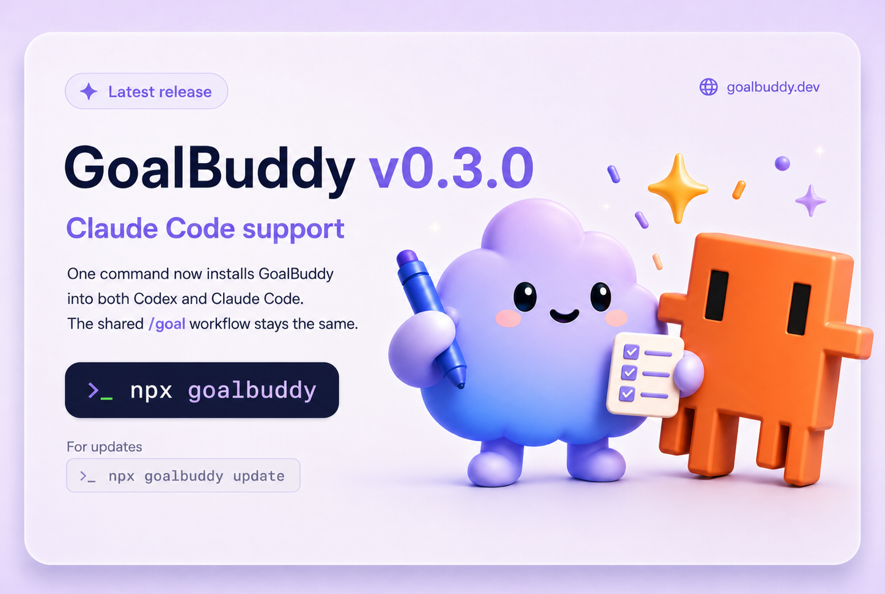

# GoalBuddy

<p align="center">
  <a href="https://goalbuddy.dev">
    
  </a>
</p>

<p align="center">
  <strong>A simple operating loop for long <code>/goal</code> runs.</strong>
</p>

<p align="center">
  <a href="https://www.npmjs.com/package/goalbuddy"></a>
  <a href="LICENSE"></a>
  <a href="https://goalbuddy.dev"></a>
</p>

GoalBuddy helps Codex and Claude Code stay oriented during long coding tasks.

It gives `/goal` a small local workspace: a charter, a board, notes, receipts, and a clear next task. The work stays in your repo, so a run can pause, resume, verify, and keep going without re-inventing the plan every turn.

## Start Here

Run one command:

```bash
npx goalbuddy
```

Restart Codex or Claude Code.

Then prepare a goal:

```text
$goal-prep
```

In Claude Code, use:

```text
/goal-prep
```

Goal Prep creates the board and prints the exact `/goal` command to run next. That is the whole path.

## What It Creates

```text
docs/goals/<your-goal>/
  goal.md
  state.yaml
  notes/
```

`goal.md` says what you want.

`state.yaml` tracks the board.

`notes/` keeps longer findings out of the main thread.

## How It Thinks

```text
rough idea -> goal prep -> /goal -> scout -> judge -> worker -> receipt -> verify
```

Scout maps the repo.

Judge chooses the next bounded slice.

Worker changes code and leaves a receipt.

`/goal` keeps the loop honest until the original goal is actually done.

## Update

When a new GoalBuddy version ships:

```bash
npx goalbuddy update
```

That updates both Codex and Claude Code.

## Live Boards

GoalBuddy can open a local board while the work is running, so you can see the plan, active task, receipts, and verification status without digging through the chat.

<p align="center">
  
</p>

## Good For

- broad project improvements
- release prep
- bug hunts that need evidence
- refactors with verification steps
- anything too large for one prompt

## For This Repo

GoalBuddy is MIT licensed and published on npm.

The implementation lives in this repo, but the happy path is intentionally tiny: install it, run Goal Prep, then let `/goal` work from the generated files.

For release process details, see [RELEASE.md](RELEASE.md).

## Star History

<a href="https://www.star-history.com/?repos=tolibear%2Fgoalbuddy&type=date&legend=top-left">
 <picture>
   <source media="(prefers-color-scheme: dark)" srcset="https://api.star-history.com/chart?repos=tolibear/goalbuddy&type=date&theme=dark&legend=top-left" />
   <source media="(prefers-color-scheme: light)" srcset="https://api.star-history.com/chart?repos=tolibear/goalbuddy&type=date&legend=top-left" />
   
 </picture>
</a>

## License

MIT
