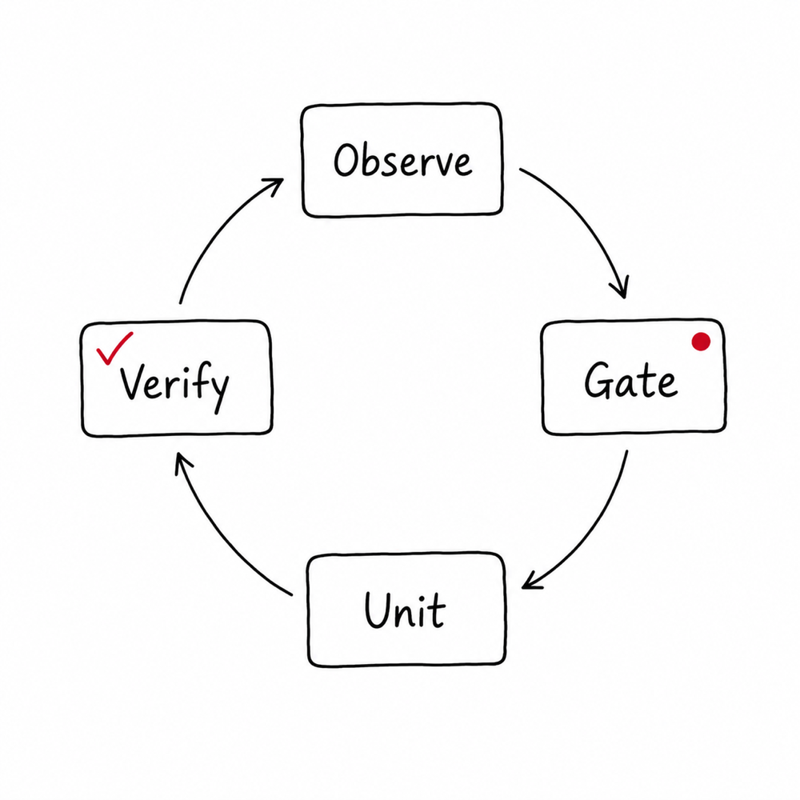
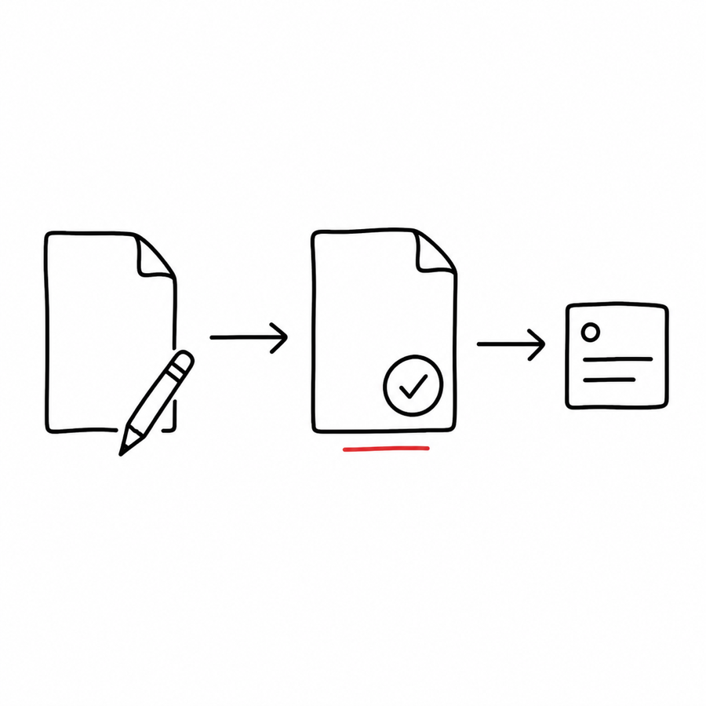
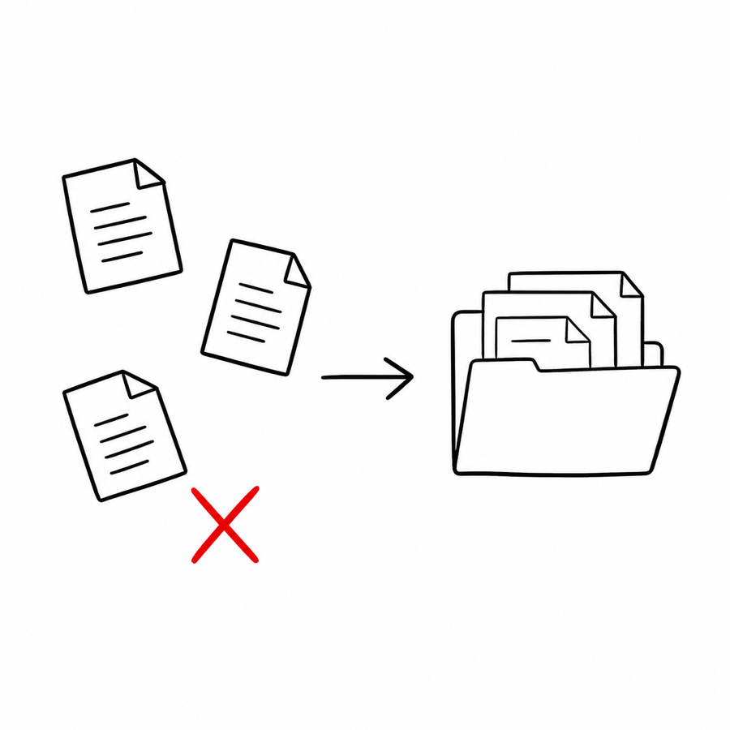

# Codex Goal Maker

Codex Goal Maker is a Codex skill for running large `/goal` efforts as a finite-state project-management loop.

It is built for goals that are too broad, stale, risky, or ambiguous to handle as a linear task list. The skill makes Codex keep explicit state, gate every continuation, execute one bounded unit at a time, record evidence, route around scoped blockers, and audit completion before calling the work done.



```text
State is truth.
Gate decides permission.
Unit is the only work.
Evidence proves progress.
Agents are tools.
```

## What It Provides

- A self-contained Codex skill in `goal-maker/`
- Goal control templates in `goal-maker/templates/`
- A state checker script: `goal-maker/scripts/check-goal-state.mjs`
- An artifact organizer for older flat goal folders: `goal-maker/scripts/organize-goal-artifacts.mjs`
- Codex metadata and optional agent definitions in `goal-maker/agents/`
- README images in `assets/`

## Repository Layout

```text
.
  README.md
  assets/
  goal-maker/
    SKILL.md
    VERSION
    agents/
    references/
    scripts/
    templates/
```

`goal-maker/` is the installable skill. Everything outside it is repo-level documentation and README artwork.

## How It Works

Each goal is operated as a state machine:

```text
observe -> gate -> choose one unit -> act or delegate -> verify -> record -> repeat
```

The loop advances only when a state transition is verified. If verification is red, Codex works on recovery. If a blocker exists, Codex records the blocked scope and keeps doing safe local work outside that scope.



The root control file is `state.yaml`. Narrative plans, matrices, audits, and reports are supporting evidence unless they match the current state and verification.

## Goal Folder Shape

Create one folder per goal:

```text
docs/goals/<slug>/
  README.md
  state.yaml
  evidence.jsonl
  units/
    active/
    completed/
    blocked/
  artifacts/
    scouts/
    judges/
    audits/
    owner-packets/
    staging-slices/
    commit-slices/
    verification/
    completion/
    archive/
```



Keep the goal root as the control plane. Root files are limited to `README.md`, `state.yaml`, `evidence.jsonl`, `review-bundles.md`, `decisions.md`, `blockers.md`, and directories.

Generated Scout reports, Judge reviews, audits, owner packets, staging slices, verification notes, and completion tables belong under `artifacts/<kind>/` and should be referenced from `state.yaml`, unit files, or `evidence.jsonl`.

## Install For Codex

Personal install:

```bash
mkdir -p ~/.codex/skills
cp -R /path/to/codex-goal-maker/goal-maker ~/.codex/skills/goal-maker
```

Project-scoped install:

```bash
mkdir -p .codex/skills
cp -R /path/to/codex-goal-maker/goal-maker .codex/skills/goal-maker
```

Install the optional Scout, Worker, and Judge agent definitions:

```bash
mkdir -p ~/.codex/agents
node ~/.codex/skills/goal-maker/scripts/install-agents.mjs ~/.codex/agents
```

## Use

Start `/goal` with an objective that points to the state machine:

```text
/goal Operate docs/goals/<slug>/state.yaml as an autonomous PM loop. On every continuation: observe current state, update the gate, execute or delegate at most one active unit, verify, append evidence, update state, and stop, route, recover, or escalate when the gate is red or blocked. Complete only after the final audit passes.
```

Check state:

```bash
node ~/.codex/skills/goal-maker/scripts/check-goal-state.mjs docs/goals/<slug>/state.yaml
```

Classify old flat artifact files:

```bash
node ~/.codex/skills/goal-maker/scripts/organize-goal-artifacts.mjs docs/goals/<slug>/state.yaml
node ~/.codex/skills/goal-maker/scripts/organize-goal-artifacts.mjs docs/goals/<slug>/state.yaml --write
```

## Core Rule

The human operator should not manage routine task breakdown. Human blockers are recorded and routed around when independent safe work remains. The goal should stop for the human only when every safe next action is blocked, credentials/access/destructive operations are required, or proceeding would be unsafe or wasteful.

Blocked has scope. If live proof, deployment, production inventory, or packaging signoff is blocked, set `gate.status: blocked` with `blocked_scope: [completion, live_proof, production_readiness]` and keep doing local work that improves truth, reviewability, handoff quality, unblock readiness, or mechanical safety.

The goal stops only when `blocked_scope` includes `all_local_work`, and that requires an exhaustion table.

## Status

Early open-source project. Do not treat this as a replacement for repo-specific `AGENTS.md`, tests, or mechanical CI checks. Use it to structure the control loop; let repo scripts enforce repo facts.
