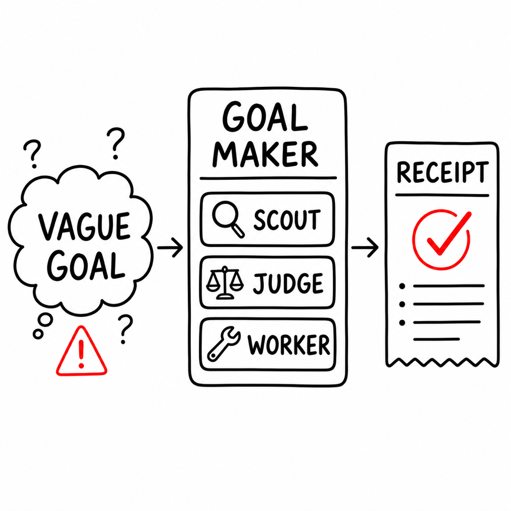

# goal-maker

Turn open-ended Codex work into a living Scout/Judge/Worker board with receipts, verification, and optional extensions.

```bash
npx goal-maker
```

Then invoke the skill inside Codex:

```text
$goal-maker
```

`$goal-maker` creates a local goal charter and task board, then prints the `/goal` command to run next. It does not start `/goal` automatically.

Native Codex `/goal` is still an under-development Codex feature. Before relying on the printed command, confirm your local Codex runtime is logged in and has goals enabled:

```bash
codex login status
codex features enable goals
npx goal-maker doctor --goal-ready
```



## Why It Exists

Long Codex goals drift. A broad request like “improve this project” can turn into unbounded edits, stale verification, and premature completion claims.

Goal Maker gives Codex an operating loop for that kind of work:

```text
vague goal -> discovery -> task board -> one active task -> receipt -> board update -> repeat
```

The main Codex thread is the PM. It owns the board, chooses the active task, delegates when useful, records receipts, and only completes after a Judge or PM audit.

## Core Features

- **Local board truth**: `goal.md` is the editable charter; `state.yaml` is the machine-readable board; `notes/` holds long receipts.
- **Default role agents**: Scout discovers evidence, Judge resolves risk and completion claims, Worker performs one bounded implementation task.
- **One active task**: keeps autonomous work sequenced and reviewable instead of turning a vague goal into a pile of parallel edits.
- **Task receipts**: every completed, blocked, or escalated task records what changed, what was learned, and what verification ran.
- **Board checker**: validates v2 goal folders and rejects old `gate`, `units`, `artifacts`, and `evidence.jsonl` layouts.
- **Extensions**: optional add-ons are discovered from `extend/catalog.json` without requiring npm updates for every integration.

## The Model

Goal Maker uses four primitives:

- **Charter**: `goal.md` states the objective, constraints, current tranche, and stop rule.
- **Board**: `state.yaml` is machine truth for tasks, status, receipts, and verification freshness.
- **Task**: exactly one active task is worked at a time.
- **Receipt**: every completed, blocked, or escalated task leaves compact proof of what happened.

Scout, Judge, and Worker are installed by default:

- **Scout** maps repo/source/spec evidence and candidate tasks.
- **Judge** resolves ambiguity, scope, risk, and completion claims.
- **Worker** performs one bounded implementation or recovery task.

The main `/goal` thread is the PM. Use medium thinking for specific bounded goals, high for open-ended/recovery/audit goals, and reserve xhigh for exceptional high-risk or multi-day final audits.

## Goal Folder

For each goal, `$goal-maker` prepares:

```text
docs/goals/<slug>/
  goal.md
  state.yaml
  notes/
```

Most task results live inline as receipts in `state.yaml`. Use `notes/<task-id>-<slug>.md` only when a Scout, Judge, or PM result is too large for the task card.

For a broad prompt like “Improve my project,” the first task should usually be Scout, not Worker:

```yaml
tasks:
  - id: T001
    type: scout
    assignee: Scout
    status: active
    objective: "Map repo health and identify improvement candidates."
    receipt: null
  - id: T002
    type: judge
    assignee: Judge
    status: queued
    objective: "Choose the next safe implementation task."
    receipt: null
  - id: T003
    type: worker
    assignee: Worker
    status: queued
    objective: "Execute the safe implementation task selected by Judge."
    allowed_files: []
    verify: []
    stop_if:
      - "Need files outside allowed_files."
      - "Verification fails twice."
    receipt: null
```

## Commands

Install or update the Codex skill and bundled agents:

```bash
npx goal-maker
npx goal-maker update
```

Repair only the agent definitions:

```bash
npx goal-maker agents
```

Check what is installed:

```bash
npx goal-maker doctor
```

Strictly check whether the native Codex `/goal` runtime is ready too:

```bash
npx goal-maker doctor --goal-ready
```

`doctor` reports missing or stale bundled agents, Codex login status, and whether the `goals` feature is enabled. `update` refreshes the installed skill and bundled agents.

Discover optional extensions from the GitHub-hosted catalog:

```bash
npx goal-maker extend
npx goal-maker extend github-pr-workflow
npx goal-maker extend install github-pr-workflow --dry-run
```

Use a non-default Codex home:

```bash
npx goal-maker install --codex-home /path/to/.codex
```

## Extensions

The npm package is the stable core. Extensions live under `extend/` and move through the GitHub-hosted `extend/catalog.json`, so users do not need a new npm release for every optional integration.

`goal-maker extend` reads the catalog and shows available extensions plus local install/configuration state. `goal-maker extend <id>` shows what an extension reads, writes, and requires. `goal-maker extend install <id>` copies a pinned, checksum-verified extension into the local Goal Maker install.

Extensions are not board truth. They may publish, report, intake, or add role guidance, but `state.yaml` remains authoritative.

The first cataloged extension, `github-pr-workflow`, prepares receipt-aligned commit boundaries and GitHub PR handoff text from goal receipts without requiring GitHub credentials or making GitHub authoritative. The catalog also includes local-first review, recovery, planning, documentation, audit, and credential-gated handoff extensions such as `ai-diff-risk-review`, `ci-failure-triage`, `docs-drift-audit`, `test-gap-planner`, `release-readiness`, `dependency-upgrade-planner`, `security-review-brief`, `codebase-onboarding-map`, `slack-standup-digest`, and `linear-ticket-handoff`.

## Running A Goal

After `$goal-maker` creates or repairs the board, start `/goal` with the printed command:

```text
/goal Follow docs/goals/<slug>/goal.md continuously through successive safe verified implementation slices until the full original outcome is complete. Do not stop after planning, Judge selection, a single verified slice, missing credentials, missing owner input, missing production access, or a blocked execute path. After each Worker slice is verified and audited, immediately advance the board to the next highest-leverage safe Worker slice and continue in the same run. If a slice is blocked by credentials, input, production access, destructive operations, or policy, mark that exact slice blocked with a receipt, create the smallest safe follow-up or workaround task, and continue all other local, non-destructive work.
```

By default, Goal Maker treats broad goals as requests for continuous work, not plan-only or one-slice exercises. Missing credentials or owner input are blockers for specific tasks, not reasons to stop the goal. A queued or active Worker task blocks `goal.status: done`; finish it, block it with a receipt, or replace it with a smaller safe Worker task before final audit. For continuous execution boards, a final audit must prove the full original outcome is complete, not merely that the latest slice passed.

Check board health:

```bash
node ~/.codex/skills/goal-maker/scripts/check-goal-state.mjs docs/goals/<slug>/state.yaml
```

## Example

See `examples/improve-goal-maker/` for a small completed reliability run, `examples/extend-catalog-workflow/` for a larger run that moves from product framing through implementation and repo cleanup, and `examples/github-pr-workflow-extension/pr-handoff.md` for an extension-generated PR handoff artifact.

## Repo Contents

- `goal-maker/SKILL.md`: the Codex skill
- `goal-maker/agents/`: Scout, Judge, and Worker definitions
- `goal-maker/templates/`: `goal.md`, `state.yaml`, and `note.md`
- `goal-maker/scripts/check-goal-state.mjs`: v2 board checker
- `internal/cli/goal-maker.mjs`: npm installer CLI
- `extend/` and `extend/catalog.json`: GitHub-hosted extension surface
- `examples/`: completed sample runs

## Status

`0.2.x` is the v2 board/receipt model. It intentionally rejects old v1 `gate`, `units`, `artifacts`, and `evidence.jsonl` goal folders instead of auto-migrating them.

Use this to structure autonomous Codex work. Keep relying on repo-specific `AGENTS.md`, tests, and CI for repo facts.

## License

MIT
