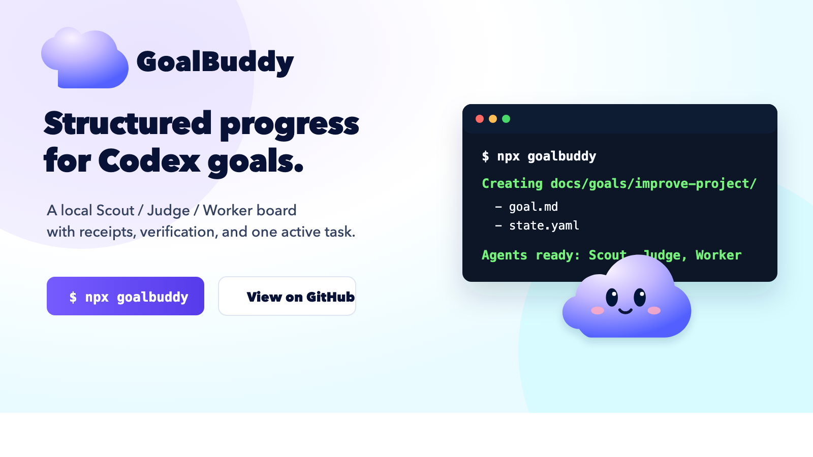

# GoalBuddy

<p align="center">
  <a href="https://goalbuddy.dev">
    
  </a>
</p>

<p align="center">
  <strong>Turn open-ended Codex work into one reviewable goal board.</strong>
</p>

<p align="center">
  <a href="https://www.npmjs.com/package/goalbuddy"></a>
  <a href="LICENSE"></a>
  <a href="https://goalbuddy.dev"></a>
</p>

GoalBuddy is a local Codex companion for work that is too broad to trust to a single prompt. It turns a vague request into a `goal.md` charter, a machine-readable `state.yaml` board, role-tagged Scout/Judge/Worker tasks, compact receipts, and verification before completion.

```bash
npx goalbuddy
```

Or install it globally:

```bash
npm i -g goalbuddy
```

Then restart Codex and invoke the installed skill:

```text
$goal-prep
```

`$goal-prep` prepares the GoalBuddy board and prints the `/goal` command to run next. It does not start `/goal` automatically.

## Why GoalBuddy Exists

Long Codex goals drift. A request like "improve this project" can turn into unbounded edits, stale verification, and premature completion claims.

GoalBuddy gives Codex a durable loop:

```text
vague goal -> Scout -> Judge -> Worker -> receipt -> verify -> repeat
```

The main `/goal` thread acts as PM. It owns the board, keeps exactly one active task, delegates when useful, records receipts, and only completes after a Judge or PM audit proves the original outcome is done.

## What You Get Locally

```text
docs/goals/<slug>/
  goal.md
  state.yaml
  notes/
```

- `goal.md` is the editable charter: objective, constraints, tranche, and stop rule.
- `state.yaml` is the board truth: task status, active task, receipts, and verification.
- `notes/` holds longer Scout, Judge, or PM findings when a task receipt would be too large.

## The Operating Model

GoalBuddy uses four primitives:

- **Charter**: states what this goal is trying to accomplish and what must stay true.
- **Board**: tracks tasks, status, receipts, and verification freshness.
- **Task**: exactly one active Scout, Judge, Worker, or PM task.
- **Receipt**: compact proof for every completed, blocked, or escalated task.

The default agents are installed with the skill:

- **Scout** maps repo evidence, workflows, constraints, risks, and candidate next tasks.
- **Judge** resolves ambiguity, scope, risk, task selection, and completion claims.
- **Worker** performs one bounded implementation or recovery slice with explicit files and checks.

## Install And Check Readiness

Install and enable the native Codex plugin:

```bash
npx goalbuddy
npm i -g goalbuddy
```

Use the skill-only fallback if your Codex build does not support plugins:

```bash
npx goalbuddy install
npx goalbuddy update
```

Native Codex `/goal` is still an under-development Codex feature. Before relying on the printed command, confirm your local Codex runtime is logged in and has goals enabled:

```bash
codex login status
codex features enable goals
npx goalbuddy doctor --goal-ready
```

Repair only the bundled agent definitions:

```bash
npx goalbuddy agents
```

Check the local install:

```bash
npx goalbuddy doctor
```

Use a non-default Codex home:

```bash
npx goalbuddy --codex-home /path/to/.codex
```

`plugin install`, `install`, `update`, and `doctor` also support `--json` when an agent or script needs structured output.

## Run A Goal

After `$goal-prep` creates or repairs the board, start the run with the printed command:

```text
/goal Follow docs/goals/<slug>/goal.md.
```

Check board health at any time:

```bash
node ~/.codex/skills/goalbuddy/scripts/check-goal-state.mjs docs/goals/<slug>/state.yaml
```

For a broad prompt like "Improve my project," the first active task should usually be Scout, not Worker:

```yaml
tasks:
  - id: T001
    type: scout
    assignee: Scout
    status: active
    objective: "Map repo health and identify improvement candidates."
    receipt: null
  - id: T002
    type: judge
    assignee: Judge
    status: queued
    objective: "Choose the next safe implementation task."
    receipt: null
  - id: T003
    type: worker
    assignee: Worker
    status: queued
    objective: "Execute the safe implementation task selected by Judge."
    allowed_files: []
    verify: []
    stop_if:
      - "Need files outside allowed_files."
      - "Verification fails twice."
    receipt: null
```

## Extensions

The npm package is the stable core. Optional extensions live under `extend/` and are discovered from the GitHub-hosted `extend/catalog.json`, so users do not need a new npm release for every integration.

```bash
npx goalbuddy extend
npx goalbuddy extend github-pr-workflow
npx goalbuddy extend install github-pr-workflow --dry-run
npx goalbuddy extend install --all --dry-run
```

`goalbuddy extend` shows available extensions plus local install state, activation state, credential requirements, safe-by-default status, and missing environment variables.

Current catalog examples include:

- `github-pr-workflow`: prepares receipt-aligned commit and PR handoff text.
- `github-projects`: mirrors GoalBuddy boards into GitHub Projects.
- `ai-diff-risk-review`: summarizes risk in the current diff.
- `ci-failure-triage`: maps failing CI back to likely causes and next tasks.
- `docs-drift-audit`: checks whether docs still match implementation.
- `codebase-onboarding-map`: creates a concise repo map from files and conventions.
- `release-readiness`: checks whether a goal is ready to publish.

Extensions can publish, report, intake, or add role guidance. They are not board truth. `state.yaml` remains authoritative.

## Compatibility Window

GoalBuddy was previously published as `goal-maker`. During the migration window, `npx goal-maker` remains available as a compatibility alias and prints the new command:

```bash
npx goalbuddy
```

Machine-readable commands such as `npx goal-maker install --json` keep JSON output clean so existing automation can migrate safely.

Release automation for future npm publishes is documented in [RELEASE.md](RELEASE.md).

## Examples

- `examples/improve-goal-maker/`: a small completed reliability run.
- `examples/extend-catalog-workflow/`: a larger run from product framing through implementation and cleanup.
- `examples/github-pr-workflow-extension/pr-handoff.md`: an extension-generated PR handoff artifact.

## Repo Map

- `goalbuddy/SKILL.md`: canonical Codex skill
- `goalbuddy/agents/`: Scout, Judge, and Worker definitions
- `goalbuddy/templates/`: `goal.md`, `state.yaml`, and `note.md`
- `goalbuddy/scripts/check-goal-state.mjs`: v2 board checker
- `internal/cli/goal-maker.mjs`: npm installer CLI
- `plugins/goalbuddy/`: repo-local Codex plugin package scaffold
- `extend/` and `extend/catalog.json`: GitHub-hosted extension surface
- `examples/`: completed sample runs

## Status

`0.2.x` is the v2 board and receipt model. It intentionally rejects old v1 `gate`, `units`, `artifacts`, and `evidence.jsonl` goal folders instead of auto-migrating them.

Use GoalBuddy to structure autonomous Codex work. Keep relying on repo-specific `AGENTS.md`, tests, and CI for repo facts.

## License

MIT
