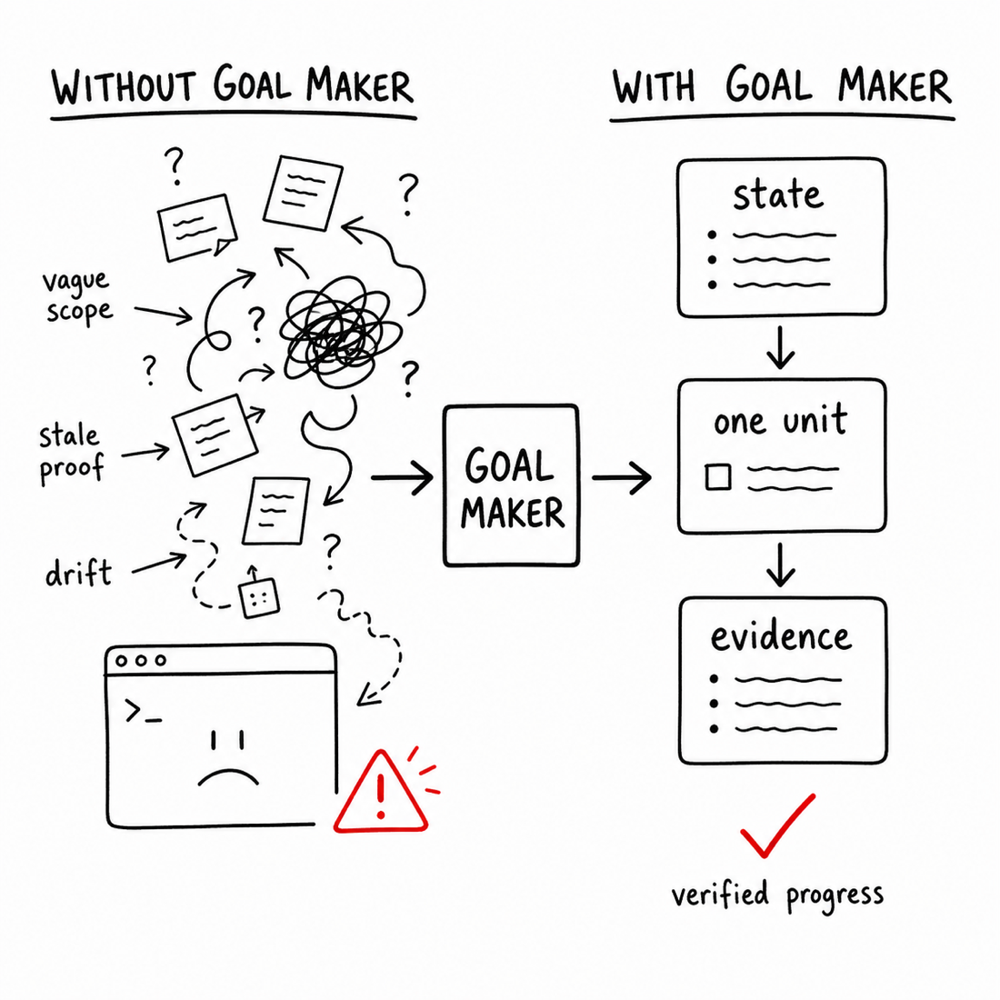

# goal-maker

A Codex skill for long-running goals: turn vague work into a rolling task board with Scout, Judge, Worker, and PM receipts.

```bash
npx goal-maker
```

Then invoke the skill inside Codex:

```text
$goal-maker
```

`$goal-maker` prepares a goal charter and task board, then prints the `/goal` command to run next. It does not start the long-running `/goal` loop automatically.

`goal-maker` installs a Codex skill plus three agent roles:

- **Scout** maps repo/source/spec evidence before work starts.
- **Worker** executes one bounded implementation or recovery task.
- **Judge** reviews ambiguity, risky scope, blockers, and completion claims.

The main Codex thread remains the PM. It owns the board, chooses the active task, and records receipts.



## Why

Long Codex goals drift: scope stays vague, stale proof looks green, and broad work becomes hard to review. `goal-maker` gives the PM thread a compact loop:

```text
vague goal -> discovery -> task board -> one active task -> receipt -> board update -> repeat
```

```text
Charter bounds the tranche.
Board is machine truth.
Task is the only work.
Receipt proves progress.
Agents are assignees.
```

## What It Provides

- An `npx` installer package named `goal-maker`
- A self-contained Codex skill in `goal-maker/`
- Bundled Scout, Worker, and Judge agent definitions in `goal-maker/agents/`
- Goal charter and board templates in `goal-maker/templates/`
- A v2 board checker: `goal-maker/scripts/check-goal-state.mjs`

## Commands

Install or update the skill and bundled agents:

```bash
npx goal-maker
npx goal-maker update
```

Repair only the agent definitions:

```bash
npx goal-maker agents
```

Check what is installed:

```bash
npx goal-maker doctor
```

Use a non-default Codex home:

```bash
npx goal-maker install --codex-home /path/to/.codex
```

## How It Works

Each goal starts with a human-editable `goal.md` charter that points to `state.yaml`.

`goal.md` defines the objective, goal kind, current tranche, constraints, and stop rule. `state.yaml` remains machine truth for the rolling task board, active task, receipts, verification freshness, and completion.

Create one folder per goal:

```text
docs/goals/<slug>/
  goal.md
  state.yaml
  notes/
```

Most task results live inline as receipts on the task board. Only create `notes/<task-id>-<slug>.md` when a Scout, Judge, or PM result is too large for the task card.

For a broad goal like “Improve my project,” the seed board should start with discovery:

```yaml
tasks:
  - id: T001
    type: scout
    assignee: Scout
    status: active
    objective: "Map repo health and identify improvement candidates."
    receipt: null
  - id: T002
    type: judge
    assignee: Judge
    status: queued
    objective: "Choose the first safe implementation tranche."
    receipt: null
  - id: T003
    type: worker
    assignee: Worker
    status: queued
    objective: "Execute the first chosen implementation task."
    allowed_files: []
    verify: []
    stop_if:
      - "Need files outside allowed_files."
      - "Verification fails twice."
    receipt: null
```

## Use

After `$goal-maker` creates or repairs the board, start `/goal` with the printed command:

```text
/goal Follow docs/goals/<slug>/goal.md
```

Check state:

```bash
node ~/.codex/skills/goal-maker/scripts/check-goal-state.mjs docs/goals/<slug>/state.yaml
```

## Repository Layout

```text
.
  README.md
  CONTRIBUTING.md
  assets/
  package.json
  goal-maker/
    bin/
    SKILL.md
    agents/
    scripts/
    templates/
    test/
```

`goal-maker/` contains the skill plus package support. The installer copies only the skill runtime files into Codex; `goal-maker/bin/` is the npm CLI and `goal-maker/test/` is local verification.

## Status

Early open-source project. Do not treat this as a replacement for repo-specific `AGENTS.md`, tests, or CI checks. Use it to structure autonomous task generation and receipts; let repo scripts enforce repo facts.
