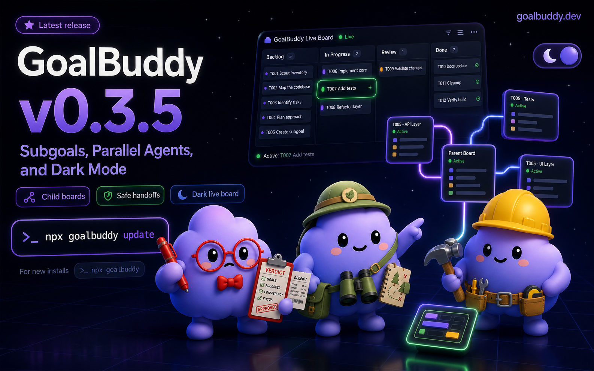
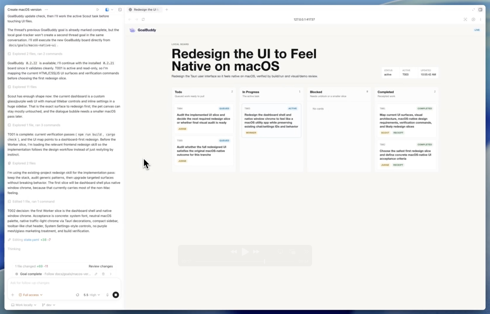

# GoalBuddy

<p align="center">
  <a href="https://goalbuddy.dev">
    
  </a>
</p>

<p align="center">
  <strong>A simple operating loop for long <code>/goal</code> runs.</strong>
</p>

<p align="center">
  <a href="https://www.npmjs.com/package/goalbuddy"></a>
  <a href="LICENSE"></a>
  <a href="https://goalbuddy.dev"></a>
</p>

GoalBuddy helps Codex and Claude Code stay oriented during long coding tasks, especially when the work branches into subgoals, parallel agents, and long-running verification.

It gives `/goal` a small local workspace: a charter, a board, notes, receipts, and a clear next task. The work stays in your repo, so a run can pause, resume, verify, and keep going without re-inventing the plan every turn.

## Start Here

Run one command:

```bash
npx goalbuddy
```

Restart Codex or Claude Code.

Then prepare a goal:

```text
$goal-prep
```

For deeper sparring before the board is written:

```text
$deep-intake
```

In Claude Code, use:

```text
/goal-prep
```

Or, for the deeper route:

```text
/deep-intake
```

Goal Prep creates the board and prints the exact `/goal` command to run next. Deep Intake does the same after the alignment pass; you do not run Goal Prep again afterward.

## Codex Install Model

For Codex, the canonical install is the native plugin plus bundled agents:

```text
~/.codex/plugins/cache/goalbuddy/goalbuddy/<version>/
  skills/goal-prep/SKILL.md
  skills/deep-intake/SKILL.md
  skills/goalbuddy/SKILL.md      # legacy alias
~/.codex/agents/goal_judge.toml
~/.codex/agents/goal_scout.toml
~/.codex/agents/goal_worker.toml
```

The Codex plugin bundles `$goal-prep` and `$deep-intake`; a clean Codex install should not need personal `~/.codex/skills/goal-prep`, `~/.codex/skills/goalbuddy`, or `~/.codex/skills/goal-maker` folders. Native Codex `/goal` is a separate OpenAI-gated feature. GoalBuddy prepares local boards and handoff prompts for it, but it does not enable or replace native `/goal`.

To verify a Codex install:

```bash
npx goalbuddy doctor --target codex --goal-ready
```

## What It Creates

```text
docs/goals/<your-goal>/
  goal.md
  state.yaml
  notes/
  subgoals/        # optional depth-1 child boards
```

`goal.md` says what you want.

`state.yaml` tracks the board.

`notes/` keeps longer findings out of the main thread.

`subgoals/` holds optional child boards when one parent task needs a bounded branch of work.

## How It Thinks

```text
rough idea -> goal prep -> /goal -> scout -> judge -> worker -> receipt -> verify
```

Scout maps the repo.

Judge chooses the next bounded slice.

Worker changes code and leaves a receipt.

`/goal` keeps the loop honest until the original goal is actually done.

## Subgoals, Parallel Agents, and Dark Mode

GoalBuddy keeps the model small:

- `state.yaml` is the source of truth.
- A board is a view of one `state.yaml`.
- The local hub is a switchboard for many boards.
- A subgoal is one depth-1 `state.yaml` linked from a parent task.
- Settings are viewer preferences, not workflow state.

Use subgoals for bounded child work that belongs to a parent task. Use multiple local boards when parallel agents or separate goal runs are active at the same time. Keep the board open in light or dark mode while the work moves.

## Execution Quality

GoalBuddy can prepare safe parallel work; it does not run a parallel org chart.

Use `goalbuddy prompt docs/goals/<slug>` to render a compact prompt for the active task without dumping the whole state file. The prompt includes a mandatory `required_spawn_agent_type`; Codex PMs should use that exact GoalBuddy agent (`goal_scout`, `goal_worker`, or `goal_judge`) instead of a generic role agent. Use `goalbuddy parallel-plan docs/goals/<slug>` to inspect read-only or disjoint write-scope work that can be handed to native Codex or Claude Code agent flows. The command reports recommendations only; it does not mutate state or spawn agents.

## Update

When a new GoalBuddy version ships:

```bash
npx goalbuddy update
```

That updates both Codex and Claude Code.

## Live Boards

GoalBuddy can open a local board while the work is running, so you can see the plan, active task, receipts, subgoals, and verification status without digging through the chat.

Multiple local boards reuse one readable `goalbuddy.localhost` hub with an in-header board switcher. When sharing a board in chat or docs, use a real Markdown link such as `[Open GoalBuddy board](http://goalbuddy.localhost:41737/<slug>/)` so the URL is clickable. The viewer also supports dark mode, compact mode, completed-task collapse, active-work motion, and reduced-motion handling.

See [GoalBuddy 0.3.5: Subgoals, Parallel Agents, and Dark Mode](RELEASE-0.3.5.md) for the release notes.

<p align="center">
  
</p>

## Good For

- broad project improvements
- release prep
- bug hunts that need evidence
- refactors with verification steps
- anything too large for one prompt

## For This Repo

GoalBuddy is MIT licensed and published on npm.

The implementation lives in this repo, but the happy path is intentionally tiny: install it, run Goal Prep, then let `/goal` work from the generated files.

For release process details, see [RELEASE.md](RELEASE.md).

## Star History

<a href="https://www.star-history.com/?repos=tolibear%2Fgoalbuddy&type=date&legend=top-left">
 <picture>
   <source media="(prefers-color-scheme: dark)" srcset="https://api.star-history.com/chart?repos=tolibear/goalbuddy&type=date&theme=dark&legend=top-left" />
   <source media="(prefers-color-scheme: light)" srcset="https://api.star-history.com/chart?repos=tolibear/goalbuddy&type=date&legend=top-left" />
   
 </picture>
</a>

## License

MIT
